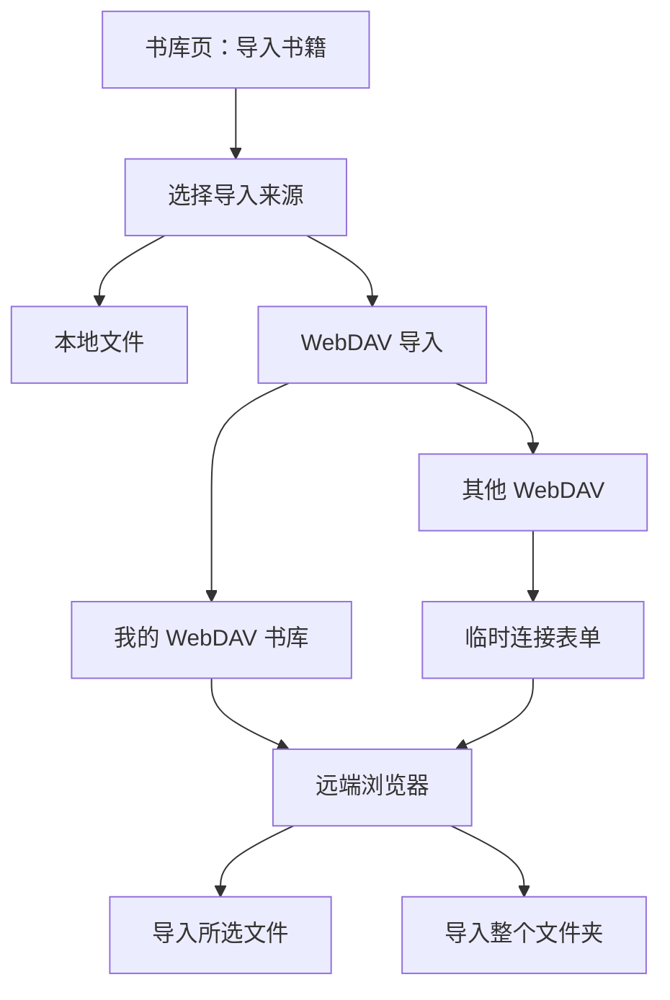

# WebDAV Import Product Positioning And IA

## 目标

ReadAny 需要的不只是“支持 WebDAV”，而是一个真正好用的“远端选书器”。

用户的真实任务不是：

- 配一个 WebDAV 技术参数页

而是：

- 从 NAS 或远端书库里挑几本书导进来
- 偶尔从另一套 WebDAV 地址临时拉几本书
- 不打乱当前同步配置
- 导入后直接进入现有书库与阅读流程

## 产品边界

WebDAV 导入必须和同步分开。

### 同步的心智

同步回答的是：

- 我这台设备和其他设备如何保持一致
- 数据库、封面、书籍文件如何镜像

当前能力主要在：

- [packages/core/src/stores/sync-store.ts](/Users/tuntuntutu/Project/ReadAny/packages/core/src/stores/sync-store.ts)
- [packages/core/src/sync/webdav-client.ts](/Users/tuntuntutu/Project/ReadAny/packages/core/src/sync/webdav-client.ts)
- [packages/app-expo/src/screens/settings/SyncSettingsScreen.tsx](/Users/tuntuntutu/Project/ReadAny/packages/app-expo/src/screens/settings/SyncSettingsScreen.tsx)
- [packages/app/src/components/settings/SyncSettings.tsx](/Users/tuntuntutu/Project/ReadAny/packages/app/src/components/settings/SyncSettings.tsx)

### 导入的心智

导入回答的是：

- 我想从远端挑哪几本书进当前书库
- 我这次是从“自己常用书库”导，还是“从别的地址临时导”

它应该被放在“书库导入”体系里，而不是“同步设置”体系里。

## 两种导入选项

建议最终产品语言使用：

1. `我的 WebDAV 书库`
2. `其他 WebDAV`

而不是：

- 当前配置
- 自定义配置

因为用户理解的是来源，不是配置形式。

### 1. 我的 WebDAV 书库

定义：

- 复用当前同步设置里已保存的 WebDAV 连接信息与远端文件夹。

适用场景：

- 用户有自己的 NAS / WebDAV 书库
- 希望经常从同一来源补书
- 不想每次重新填地址和密码

产品价值：

- 零配置成本
- 和“我的远端书库”建立稳定心智

### 2. 其他 WebDAV

定义：

- 用户临时输入一个 WebDAV 地址、账号、密码和远端文件夹，单次浏览与导入。

适用场景：

- 从另一个 NAS 临时导书
- 从共享书库导几本
- 不想覆盖当前同步配置

产品价值：

- 弹性强
- 不破坏已配置好的同步环境

## 信息架构

建议导入入口层级如下：

## 为什么不建议一上来就给文件树

如果用户点“导入书籍”，马上进入 WebDAV 文件树，会有三个问题：

- 用户还没想清楚这次是从哪个来源导
- 已配置 WebDAV 和临时 WebDAV 会混掉
- 技术感太强，不像“选书”

所以第一步必须先确认来源，而不是直接丢给用户一个目录浏览器。

## 移动端信息架构

移动端要优先保证“少步骤、好点、好选”。

### 入口

- 书库页右上角 `导入`
- 空状态按钮 `导入书籍`

### 第一步：来源选择 Sheet

建议做成底部弹层，三项：

- `本地文件`
- `我的 WebDAV 书库`
- `其他 WebDAV`

这样用户不用再经历“先选 WebDAV，再选当前/临时”的两层弹窗。

如果当前没有配置 WebDAV：

- `我的 WebDAV 书库` 显示为可点击，但副文案提示“先完成同步设置”

### 第二步：远端浏览页

移动端用全屏页，而不是再次弹层。

页面结构：

- 顶部：返回、路径标题、搜索
- 中间：目录与书籍列表
- 底部：已选数量 + `导入所选`

辅助操作：

- `全选本页`
- `导入当前文件夹`
- `仅显示支持格式`

## 桌面端信息架构

桌面端更适合双栏浏览。

页面结构建议：

- 左侧：目录树 / 面包屑 / 收藏文件夹
- 右侧：文件列表
- 底部右侧：`导入所选`

选中一本文件时，可以在右侧扩展区看到：

- 文件名
- 格式
- 大小
- 修改时间
- 预计导入为哪本书的标题（如果能预解析）

## 浏览器不是文件管理器，而是选书器

这个模块最重要的产品原则是：

不要把它做成一个通用 WebDAV 文件管理器。

它应该是一个面向“书籍文件”的浏览器，所以默认行为要偏书籍：

- 只突出显示支持导入的格式
- 非书籍文件默认弱化或隐藏
- 文件夹中如果大部分是书，直接显示“共 18 本可导入”
- 支持一键导入整个文件夹

## 导入动作设计

在浏览页内，建议同时支持两种动作：

1. `导入所选文件`
2. `导入整个文件夹`

这是操作层级，不是来源层级。

原因：

- “来源”回答的是从哪里来
- “动作”回答的是这次怎么导

两者不能混成同一层级，否则用户会迷路。

## 关键产品原则

这套能力设计时要一直遵守五条原则：

1. `来源优先`
   - 先让用户明确“从哪里导”，再进入浏览。

2. `选书优先`
   - 浏览器是选书器，不是文件管理器。

3. `不打扰同步`
   - 临时导入不覆盖同步配置。

4. `复用已有入库链路`
   - WebDAV 只负责列表与下载，入库仍走现有 `importBooks` 流程。

5. `低风险渐进扩展`
   - v1 先支持浏览、多选、导入、去重；收藏文件夹、历史来源、封面预览可以后补。
