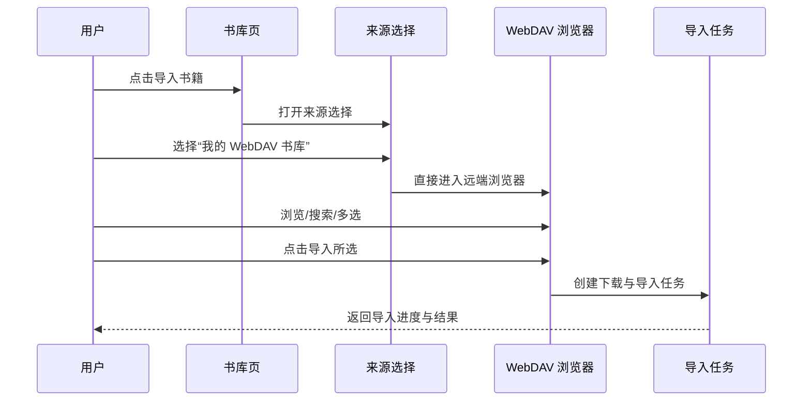
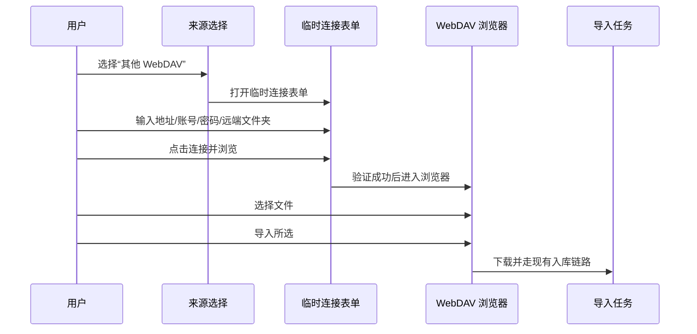

# WebDAV Import Interaction Flows And States

## 总体交互原则

交互上要避免两个极端：

- 太技术：一上来先填一堆 URL、路径、端口、认证
- 太黑箱：点一下“导入”后不知道它在远端做了什么

最佳体验应该是：

- 轻入口
- 清晰来源
- 快速浏览
- 明确选择
- 可预期下载
- 清楚反馈结果

## Flow 1：从“我的 WebDAV 书库”导入

### 细节建议

- 默认打开用户上次浏览到的文件夹
- 顶部路径支持点击返回上级
- 搜索默认搜文件名，不搜内容
- 选中文件后底部操作栏常驻显示

## Flow 2：从“其他 WebDAV”临时导入

### 临时连接表单该怎么做

不要做成和同步设置页一样完整的长表单。

它应该是一个轻量连接面板，只保留：

- 服务器地址
- 用户名
- 密码
- 远端文件夹

高级项默认折叠：

- 允许不安全连接
- 请求超时

这样临时导入才像“快速接入”，而不是重新配置一个同步后端。

## 浏览页应该具备的能力

### 必备

- 面包屑 / 当前路径
- 上一级返回
- 搜索文件名
- 多选
- 文件夹优先展示
- 支持格式过滤
- 底部常驻导入按钮

### 推荐

- 最近浏览路径
- 当前文件夹可导入数量
- 全选本页
- 导入整个文件夹

### 暂不建议在 v1 做太重

- 在线封面预解析
- 在线元数据完整预览
- WebDAV 内直接重命名/删除

这些都会把“选书器”做成“文件管理器”，容易跑偏。

## 列表项设计建议

### 文件夹项

展示：

- 文件夹名
- 可导入书籍数（如果能快速统计）
- 更新时间

交互：

- 点击进入
- 长按或二级按钮可 `导入整个文件夹`

### 文件项

展示：

- 文件名
- 格式
- 文件大小
- 修改时间

选中态：

- 左侧勾选
- 整行可点选
- 不要只让用户点很小的 checkbox

## 重复导入策略

这是体验里非常关键的一块。

建议规则：

### 检测优先级

1. 已有文件哈希命中
2. 文件名 + 大小近似命中
3. 导入后 metadata 标题/作者近似命中

### v1 交互

当发现重复时：

- 不要在导入前逐个弹窗打断用户
- 应该放进导入结果汇总页里统一处理

结果展示：

- 成功导入 8 本
- 已跳过 3 本（已存在）
- 失败 1 本

如果用户点进“已跳过”：

- 展示跳过原因
- 可以补一个“仍然导入副本”的二次动作

## 导入进度怎么反馈

导入不应该只有一个模糊的 loading。

建议分成三个阶段：

1. `正在下载`
2. `正在解析书籍信息`
3. `正在导入书库`

对于多文件导入：

- 顶部或底部显示总进度：`3 / 12`
- 当前处理文件显示文件名
- 支持最小化进度，不要强制卡在页面上

## 异常状态设计

### 1. 未配置“我的 WebDAV 书库”

展示：

- 空状态说明
- CTA：`前往同步设置`

不要直接报错。

### 2. 连接失败

错误要尽量翻译成用户能懂的话：

- 地址或端口不可达
- 认证失败
- 目录不存在
- 服务器不支持当前请求

并提供就地动作：

- `重试`
- `修改连接信息`

### 3. 文件夹为空

不要只写“空文件夹”。

应该区分：

- 此目录没有任何文件
- 此目录没有可导入的书籍文件

后者才是更常见的真实情况。

### 4. 部分文件失败

不能让整个任务因为一本坏文件全部失败。

应支持：

- 部分成功
- 失败文件单独列出
- 后续重试失败项

## 移动端与桌面端的差异化建议

### 移动端

- 重点是少层级、强反馈
- 底部操作栏固定
- 搜索与筛选尽量轻
- 不适合放太多辅助信息

### 桌面端

- 重点是高密度浏览和批量导入
- 左右分栏
- 支持键盘操作
- 可同时显示目录树、文件列表、详情区

## 入口文案建议

为了让产品语言更自然，建议使用下面这些文案：

- `导入书籍`
- `WebDAV 导入`
- `我的 WebDAV 书库`
- `其他 WebDAV`
- `连接并浏览`
- `导入所选`
- `导入当前文件夹`
- `仅显示可导入书籍`
- `已存在，已跳过`

避免使用：

- 当前配置
- 自定义配置
- 扫描远端
- 应用配置

这些更像技术语言，不像书库产品语言。
