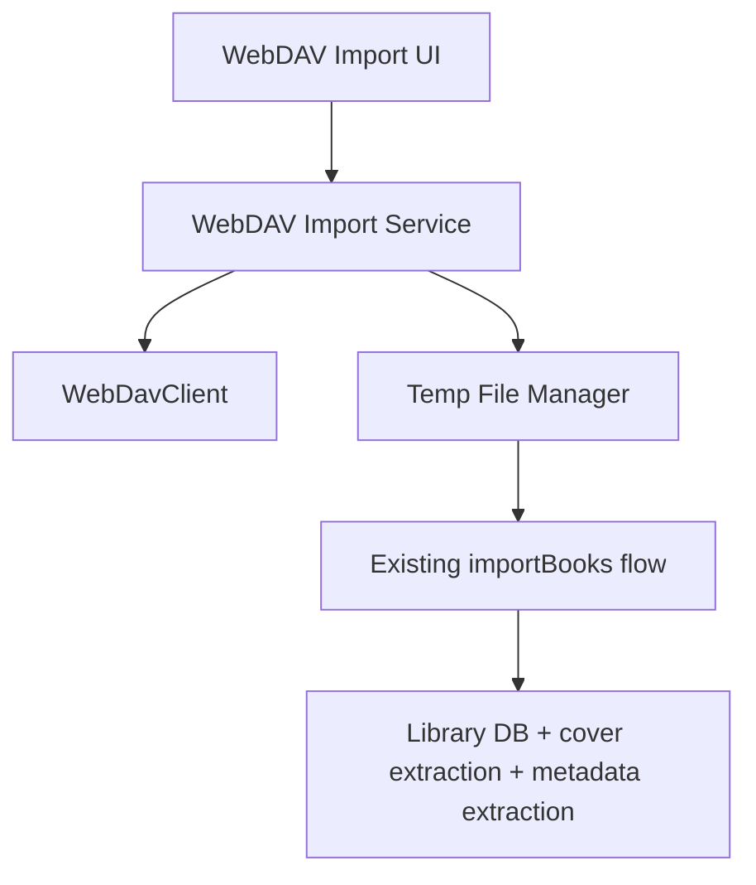

# WebDAV Import Implementation Roadmap

## 总体策略

最稳的做法不是把 WebDAV 导入塞进同步链路，而是：

1. 用现有 WebDAV client 负责远端浏览与下载
2. 下载到本地临时目录
3. 复用现有 `importBooks` 入库流程

这样风险最小，也能天然继承：

- 元数据提取
- 封面提取
- 文件落盘
- 书库刷新

## 当前可复用基础

### 1. WebDAV 连接与目录能力

已有：

- [packages/core/src/sync/webdav-client.ts](/Users/tuntuntutu/Project/ReadAny/packages/core/src/sync/webdav-client.ts)
- [packages/core/src/sync/webdav-backend.ts](/Users/tuntuntutu/Project/ReadAny/packages/core/src/sync/webdav-backend.ts)
- [packages/core/src/stores/sync-store.ts](/Users/tuntuntutu/Project/ReadAny/packages/core/src/stores/sync-store.ts)

这里已经具备：

- 连接测试
- 远端路径处理
- 文件读写
- 目录操作

### 2. 移动端导入链路

已有：

- [packages/app-expo/src/screens/LibraryScreen.tsx](/Users/tuntuntutu/Project/ReadAny/packages/app-expo/src/screens/LibraryScreen.tsx)
- [packages/app-expo/src/stores/library-store.ts](/Users/tuntuntutu/Project/ReadAny/packages/app-expo/src/stores/library-store.ts)

目前移动端是：

- `DocumentPicker` 选本地文件
- 调 `importBooks(files)`
- store 负责复制文件、提取 metadata、入库

### 3. 桌面端导入链路

已有：

- [packages/app/src/components/home/HomePage.tsx](/Users/tuntuntutu/Project/ReadAny/packages/app/src/components/home/HomePage.tsx)
- [packages/app/src/components/home/ImportDropZone.tsx](/Users/tuntuntutu/Project/ReadAny/packages/app/src/components/home/ImportDropZone.tsx)
- [packages/app/src/stores/library-store.ts](/Users/tuntuntutu/Project/ReadAny/packages/app/src/stores/library-store.ts)

桌面端当前已支持：

- 本地导入
- 拖拽导入

## 建议的新分层



## 建议新增模块

### Core / shared

建议新增：

- `packages/core/src/import/webdav-import-types.ts`
- `packages/core/src/import/webdav-import-service.ts`

建议类型：

```ts
export type WebDavImportSourceKind = "saved" | "temporary";

export interface WebDavImportSource {
  kind: WebDavImportSourceKind;
  url: string;
  username: string;
  password: string;
  remoteRoot: string;
  allowInsecure?: boolean;
}

export interface RemoteImportEntry {
  name: string;
  path: string;
  isDirectory: boolean;
  size: number;
  lastModified?: number;
  extension?: string;
  importable: boolean;
}

export interface RemoteImportResult {
  imported: number;
  skipped: number;
  failed: number;
  failedItems: Array<{ path: string; reason: string }>;
}
```

### App 层

移动端建议新增：

- `packages/app-expo/src/screens/library/WebDavImportSourceSheet.tsx`
- `packages/app-expo/src/screens/library/WebDavConnectSheet.tsx`
- `packages/app-expo/src/screens/library/WebDavBrowserScreen.tsx`

桌面端建议新增：

- `packages/app/src/components/library/WebDavImportDialog.tsx`
- `packages/app/src/components/library/WebDavBrowser.tsx`

## Phase 1：只打通“我的 WebDAV 书库”

目标：

- 从已保存的 WebDAV 配置进入远端浏览器
- 可浏览、可多选、可导入

建议动作：

1. 复用当前 sync store 的已保存 WebDAV 配置
2. 用 WebDavClient 拉取目录列表
3. 下载所选文件到临时目录
4. 调现有 `importBooks`

阶段收益：

- 最快验证“远端导书”主路径
- 不引入临时连接表单复杂度

## Phase 2：补“其他 WebDAV”

目标：

- 支持临时输入地址与认证信息进行导入

建议动作：

1. 新建轻量临时连接表单
2. 支持连接测试
3. 连接成功后进入同一个浏览器页面

阶段收益：

- 用户不必绑定当前同步配置
- 可从任意兼容 WebDAV 的书库临时拉书

## Phase 3：补批量导入与去重

目标：

- 多选导入
- 文件夹整批导入
- 重复文件跳过与结果汇总

建议动作：

1. 实现导入队列
2. 增加结果汇总页
3. 按文件哈希 / 文件名 + 大小做去重提醒

## Phase 4：体验增强

目标：

- 让这个能力从“能用”变成“顺手”

建议动作：

1. 记住最近浏览路径
2. 记住最近使用的临时来源
3. 支持收藏常用文件夹
4. 当前文件夹显示“可导入书籍数”

## 技术关键点

### 1. 不直接把远端文件路径塞给 importBooks

现有 `importBooks`：

- 移动端收的是 `uri`
- 桌面端收的是本地文件路径

所以 WebDAV 文件必须先下载到本地临时文件，再交给现有导入链路。

### 2. 下载与导入要解耦

建议两段式：

- `downloadRemoteFiles()`
- `importDownloadedFiles()`

这样未来更方便做：

- 失败重试
- 进度展示
- 批处理

### 3. 浏览器不要依赖同步流程

同步是：

- 数据库快照
- 文件镜像
- manifest 对比

WebDAV 导入不需要这些。

它只需要：

- 目录浏览
- 文件下载
- 本地导入

实现上一定要轻，不要把同步层整个拖进来。

## 建议开工顺序

最稳的顺序是：

1. 冻结本目录文档
2. 先做移动端 `我的 WebDAV 书库`
3. 跑通下载到临时目录再导入
4. 再补桌面端双栏浏览器
5. 最后补 `其他 WebDAV`

## 阶段验收标准

### Phase 1

- 已配置 WebDAV 的用户能成功浏览远端目录
- 能选中一本或多本书导入
- 导入后能正常出现在书库中

### Phase 2

- 未使用当前同步配置也能临时连接导书
- 临时导入不覆盖当前同步配置

### Phase 3

- 多选导入稳定
- 重复导入有清晰反馈
- 部分失败不会拖垮整体任务

### Phase 4

- 常用路径可复用
- 用户多次导书时明显更顺

## 暂不做的内容

为了避免第一版过重，下面这些建议后置：

- 在线预览书籍正文
- 在 WebDAV 内直接重命名/移动/删除文件
- 自动联网抓更多书籍元数据
- 远端封面即时渲染

第一版的目标是：

把远端书“稳定、清楚、顺手地导进来”。
